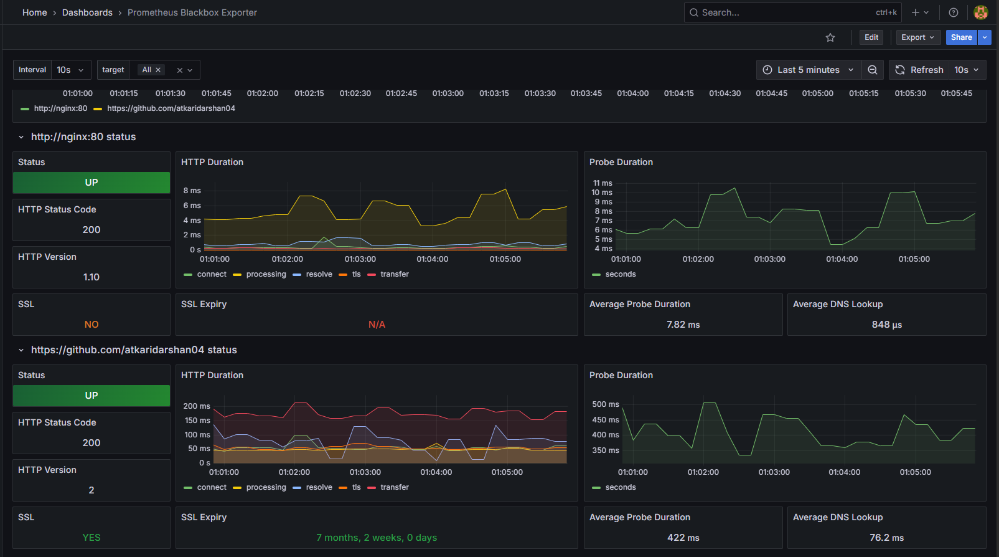

# 📊 Monitoring Stack 

## 🔍 Service Endpoints

| Service | URL | Purpose |
|---------|-----|---------|
| **Flask App** | [http://localhost:5000](http://localhost:5000) | Main application |
| **Nginx Proxy** | [http://localhost:80](http://localhost:80) | Load balancer |
| **Prometheus** | [http://localhost:9090](http://localhost:9090) | Metrics collection |
| **Grafana** | [http://localhost:3000](http://localhost:3000) | Dashboards |
| **Node Exporter** | [http://localhost:9100](http://localhost:9100) | System metrics |
| **cAdvisor** | [http://localhost:8080](http://localhost:8080) | Container metrics |
| **Blackbox Exporter** | [http://localhost:9115](http://localhost:9115) | Health checks |

## ✅ Step 1: Verify Prometheus Targets

First, check that Prometheus is **successfully scraping all services**.

1. Go to **Prometheus UI**: [http://localhost:9090/targets](http://localhost:9090/targets)

2. **Expected targets and their status**:
   - `node-exporter` (9100) - **UP** ✅
   - `blackbox` (nginx:80, github.com) - **UP** ✅
   - `blackbox_exporter` (9115) - **UP** ✅
   - `cadvisor` (8080) - **UP** ✅

➡️ Status should be **UP**. If any are **DOWN**, check the troubleshooting section below.

## ✅ Step 2: Configure Grafana Data Source

1. **Access Grafana**: [http://localhost:3000](http://localhost:3000)
   - **Default Login**: `admin / admin`

2. **Add Prometheus Data Source**:
   - Click **Add Data Source**
   - Select **Prometheus**
   - Set URL to: `http://prometheus:9090`
   - Click **Save & Test**

## ✅ Step 3: Import Pre-built Dashboards

### 🐳 Container Metrics Dashboard (cAdvisor)
1. Go to **Create** (+) → **Import**
2. Dashboard ID: **193**
3. Name: "Docker Container & Host Metrics"
4. Select Prometheus data source
5. Click **Import**

### 🖥️ System Metrics Dashboard (Node Exporter)
1. Dashboard ID: **1860**
2. Name: "Node Exporter Full"
3. Shows CPU, Memory, Disk, Network metrics

### 🔧 Application Health Dashboard (Blackbox Exporter)
1. Dashboard ID: **7587**
2. Name: "Blackbox Exporter"
3. Shows uptime, response times, SSL certificate status

---

### All Dashboards

---