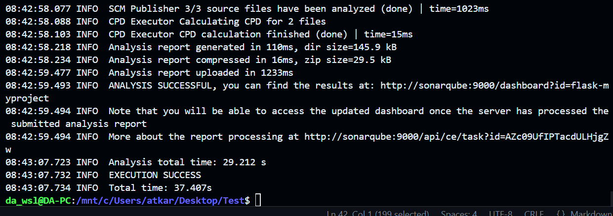
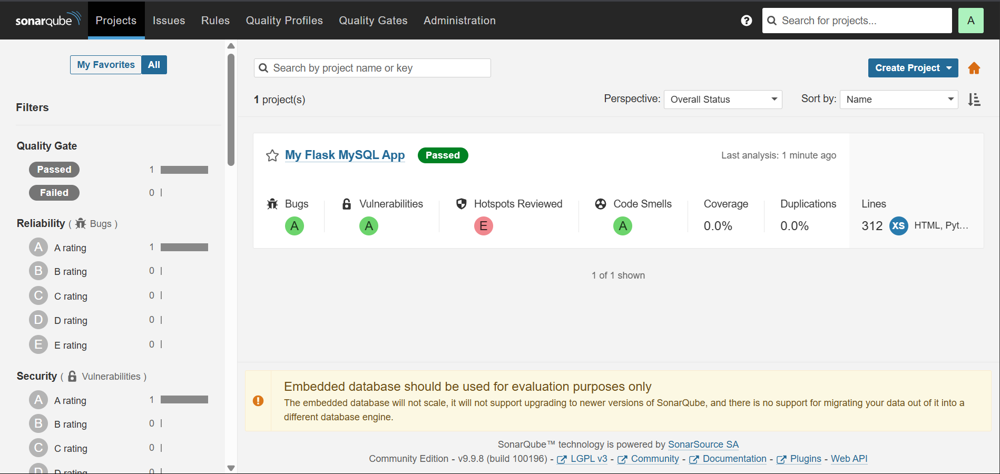

# SonarQube Analysis 

This guide walks you through running **SonarQube analysis** for a **Flask + MySQL** project using Docker and the SonarScanner CLI — **no CI/CD pipeline needed**.

## 🧩 Prerequisites

Ensure you have  **Java 11+** (required by SonarScanner)

Install Java (e.g., OpenJDK 17):

```bash
sudo apt install openjdk-17-jre-headless
```

## 🚀 Step 1: Start SonarQube Server

Run SonarQube using Docker (and a Docker network for easier communication):

```bash
docker network create sonar-net

docker run -d \
  --name sonarqube \
  --network=sonar-net \
  -p 9000:9000 \
  sonarqube:lts-community
```

Once running, visit [http://localhost:9000](http://localhost:9000).
Log in with:

```
Username: admin
Password: admin
```

Then go to **My Account → Security**, generate a token (e.g., `flask-token`) — **you'll use this in the next step**.


## 📄 Step 2: Create `sonar-project.properties` File

Create this file in the **root of your Flask project directory**:

```properties
sonar.projectKey=flask-myproject
sonar.projectName=My Flask MySQL App
sonar.projectVersion=1.0
sonar.sources=flask-mysql-app
sonar.sourceEncoding=UTF-8
sonar.host.url=http://localhost:9000
sonar.login=<SONAR_TOKEN>
```

> 🔁 Replace `<SONAR_TOKEN>` with the token you generated.

> 🗂️ Update `sonar.sources` to point to your actual source code directory (e.g., `.` or `app`).


## 🧪 Step 3: Run SonarScanner via Docker

### ✅ For WSL:

```bash
docker run --rm \
  -e SONAR_HOST_URL="http://sonarqube:9000" \
  --network=sonar-net \
  -v "$(pwd):/usr/src" \
  -w /usr/src \
  sonarsource/sonar-scanner-cli
```

### ✅ For Linux (native terminal):

```bash
docker run --rm \
  -e SONAR_HOST_URL="http://sonarqube:9000" \
  --network=sonar-net \
  -v "${PWD}:/usr/src" \
  -w /usr/src \
  sonarsource/sonar-scanner-cli
```

## ✅ Step 4: View Results

If the scan succeeds, you’ll see logs like:



Open [http://localhost:9000](http://localhost:9000) in your browser, and you’ll see your Flask project analyzed with detailed code quality metrics.

